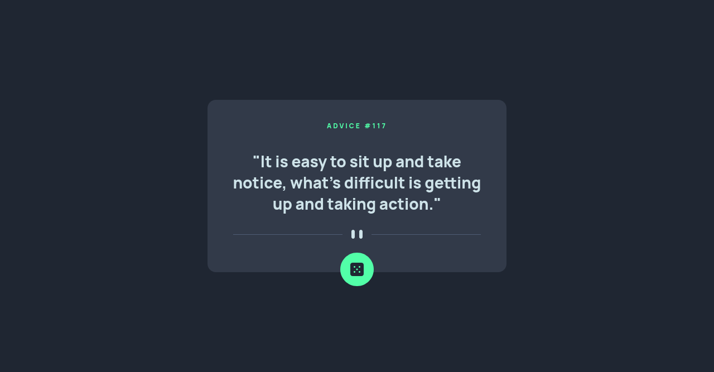

# Frontend Mentor - Advice generator app solution

This is a solution to the [Advice generator app challenge on Frontend Mentor](https://www.frontendmentor.io/challenges/advice-generator-app-QdUG-13db). Frontend Mentor challenges help you improve your coding skills by building realistic projects.

## Table of contents

- [Frontend Mentor - Advice generator app solution](#frontend-mentor---advice-generator-app-solution)
  - [Table of contents](#table-of-contents)
  - [Overview](#overview)
    - [The challenge](#the-challenge)
    - [Screenshot](#screenshot)
    - [Links](#links)
  - [My process](#my-process)
    - [Built with](#built-with)
    - [Useful resources](#useful-resources)
  - [Author](#author)
  - [Acknowledgments](#acknowledgments)

**Note: Delete this note and update the table of contents based on what sections you keep.**

## Overview

### The challenge

Users should be able to:

- View the optimal layout for the app depending on their device's screen size
- See hover states for all interactive elements on the page
- Generate a new piece of advice by clicking the dice icon

### Screenshot



### Links

- Solution URL: [Add solution URL here](https://your-solution-url.com)
- Live Site URL: [Add live site URL here](https://your-live-site-url.com)

## My process

### Built with

- Semantic HTML5 markup
- CSS custom properties
- Flexbox
- Mobile-first workflow

### Useful resources

- [The trick to viewport units - CSS Tricks](https://css-tricks.com/the-trick-to-viewport-units-on-mobile/) - This helped me with some struggles i've been having, they talked about how we can make the `body` tag equal to the viewport height and also a way to keep things responsive. Check it out if you're interested!

## Author

- Frontend Mentor - [@ZenitsuAg](https://www.frontendmentor.io/profile/ZenitsuAg)

## Acknowledgments

- Melvin Aguilar -[MelvinAguilar](https://github.com/MelvinAguilar) Line 28 of his javascript main.js file helped me in my solution
  ```js
  { method: 'GET', mode: 'cors', cache: 'no-cache' }
  ```
  This helped to generate advice each time you click on the dice. The previous advice is not cached.
  
- I give thanks to you, God Almighty for your grace and continuous support. Without you Lord Jesus, I wouldn't have come this far.